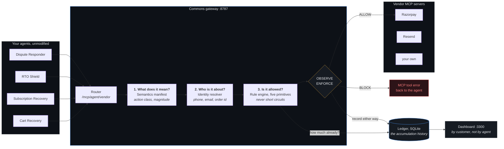

# Commons

**An arbitration layer for merchants running more than one AI agent.** Every agent
platform scopes permissions to the agent. Commons scopes limits to the customer being
acted upon.

---

## The problem

A merchant runs four agents. Cart Recovery chases abandoned baskets. Subscription
Recovery rescues failed mandates. RTO Shield blocks cash-on-delivery for return risks.
Dispute Responder handles chargebacks.

Each one is well built. Each has its own limits and stays inside them. Each is
individually correct. And then:

> Cart Recovery offers a customer 10% off to rescue their basket. Subscription Recovery,
> working the same person's failed mandate, offers 8% to keep them. Neither agent exceeded
> its own ceiling. **The customer is now holding 18% against a merchant cap of 15%.**

> RTO Shield decides a customer is a return risk and locks their order to prepaid only.
> An hour later Cart Recovery offers that same customer 10% off to buy.
> **The merchant is arguing with itself, and neither agent can see it.**

Nobody violated anything. There is no misbehaving agent to find. The failure is *between*
agents, and it accumulates on a person that no single agent can see the whole of.

Every access-control system since the 1970s asks **"may this actor do this?"** That
question cannot catch either case above, because the answer is yes, every time.

---

## What Commons does

Commons is an MCP gateway that sits between your agents and the vendor servers they call.
It asks a different question: **"has too much happened to this customer?"**

It sits in the path because it is the only place that can. It sees every agent's calls to
every vendor, so it can hold the one piece of state no agent has: the running total for
one human being, across all of them.

Three properties make it usable on agents you did not write:

**One line changes.** Point an agent's MCP config at Commons instead of the vendor.
Nothing inside the agent changes, so this works on third-party and closed-source agents.

```diff
- "razorpay": { "url": "https://mcp.razorpay.com/mcp" }
+ "razorpay": { "url": "http://127.0.0.1:8787/mcp/cart-recovery/razorpay" }
```

**It reads vendor schemas, not vendor source.** A manifest maps each published tool to
what it does and to whom. That is what lets Commons govern a third-party agent calling a
third-party vendor.

**Observe before enforce.** It starts in OBSERVE, where nothing is blocked and every
decision is recorded. Watch it for a few days, correct the rules that misfire, then switch
to ENFORCE. The same engine runs in both modes.

---

## Architecture



The decision path is four steps, and the interesting one is step 2. A rule about a person
cannot fire unless the gateway knows that a phone number on a Razorpay call and an email
on a Resend call are the same human. Mappings are **declared by the merchant**, never
inferred, because a wrong merge is a wrong enforcement decision.

Everything is scoped by `run_id`, and a run is a deployment lifetime rather than a process
lifetime. Restarting the gateway resumes the open run, so nobody's 30-day discount budget
resets because you deployed.

---

## What it enforces

Five primitives, each about **accumulation on one customer**. None can be checked from a
single call in isolation, which is exactly why per-agent validation cannot express them.

| Rule | Question it answers |
|---|---|
| `RateLimit` | How many times has this happened to them in a window? |
| `CumulativeBudget` | How much have they been given in total? |
| `StateCondition` | Is this allowed given their current state? |
| `MutualExclusion` | Is another agent already working this order? |
| `Contradiction` | Does this undo what another agent just did? |

The last one is the interesting one. A fulfilment restriction and a discount incentive on
the same customer is not a limit breach. Nobody exceeded anything. It is the merchant
working against itself, and no per-agent control can see it.

Limits are editable on the Rules screen and take effect on the next call. Your agents stay
connected.

---

## Reproduce it

```bash
git clone https://github.com/sohamwas/commons
cd commons
python scripts/start.py
```

That is the whole thing. It creates the virtualenv, installs both sets of dependencies,
starts the gateway, the dashboard and the reference messaging vendor, waits until each is
answering, and prints where to look. Ctrl+C stops all of them.

Dashboard on <http://localhost:3300>, gateway on <http://localhost:8787>. It starts in
OBSERVE, which blocks nothing.

```bash
python scripts/start.py --mode ENFORCE     # start enforcing straight away
python scripts/start.py --no-messaging     # skip the local reference vendor
python scripts/start.py --gateway-port 9000 --dashboard-port 4000
```

**Requirements:** Python 3.11+ and Node 20+. Nothing else. The launcher is stdlib only,
because a script whose job is installing the dependencies cannot have dependencies.

First run installs npm packages and takes a few minutes. After that the gateway answers in
seconds and the dashboard in under a minute.

### Verified on

| | Status |
|---|---|
| Windows 11, Python 3.13, Node 25 | verified from a cold clone |
| macOS / Linux | correct code paths, not executed |

The POSIX branches (`venv/bin/python`, process-group shutdown) are written and reviewed
but have not been run on that hardware. If you hit something, open an issue with the
output and it is likely a one-line fix.

One real caveat worth stating: `pyproject.toml` uses lower bounds (`mcp>=2.0.0`), and
there is no Python lockfile. A clone today resolves current versions; a clone in a year
may resolve different ones. The dashboard is pinned by `package-lock.json`; the Python
side is not.

### Then connect your own

1. **Vendors.** On **Connect**, add an MCP server by URL. Razorpay needs test-mode keys in
   `.env`. Write a secret header as `env:NAME` so the token lives in `.env`, not in a YAML
   file you might screen-share.
2. **Agents.** Register each agent to get its endpoints, then paste
   `http://127.0.0.1:8787/mcp/<agent>/<vendor>` into that agent's MCP config.
3. **Customers.** On **Data**, sync from Razorpay or import a CSV.
   `examples/sample-customers.csv` shows the shape.
4. **Watch, then enforce.** Leave it in OBSERVE for a few days. Work through **Review**:
   for each flagged call, say whether it should have been stopped. A rule you keep marking
   wrong is a rule that needs changing, not agents that do. When you are convinced, switch
   to ENFORCE from the header.

---

## How it knows what a call means

A **semantics manifest** maps each vendor tool to what it does and to whom:

```yaml
create_payment_link:
  action_class: discount_grant
  entity:    { from: args, path: customer_contact, as: phone }
  magnitude: { from: args, path: notes.discount_pct, unit: percent }
  resource:  { from: args, path: [notes.order_id, notes.subscription_id] }
```

These are written from the vendor's **published tool schemas**, not from its source. That
is what lets Commons govern a third-party agent calling a third-party vendor. Manifests
live in `commons/semantics/manifests/`; a new vendor needs one.

Classification is **governed by default**. A tool is promotional unless a merchant-approved
tag or template says otherwise, so an agent cannot exempt itself from a frequency cap by
omitting a field or inventing a label.

---

## Layout

```
commons/proxy/       the gateway: routing, the decision path, the agent registry
commons/rules/       the five primitives and the policy engine
commons/ledger/      SQLite: every call, every decision, every review
commons/identity/    entity resolution and customer import
commons/semantics/   what each vendor tool means
dashboard/           the local dashboard (Next.js)
mcp_servers/         a reference messaging vendor, and an in-memory one for tests
examples/            a worked agent that imports nothing from commons/
scripts/             start (the one-command launcher), run_proxy, the stress harness
```

`agents.yaml`, `vendors.yaml` and `commons.db` are created on first run. They are yours;
none are committed.

---

## Testing

```bash
.venv/Scripts/python.exe -m pytest tests/ -q      # Windows
.venv/bin/python -m pytest tests/ -q              # macOS, Linux
.venv/Scripts/python.exe scripts/stress_commons.py
```

The stress harness runs a second gateway on its own port and database with in-memory
vendors, so it never touches your data or your Razorpay account. It covers load,
concurrent grants against one cap, edge cases, enforcement, and latency.

Three bugs worth knowing about, because all three only appear under real use:

- A call the vendor **rejected** used to consume the customer's budget, so a payment link
  that failed still spent their discount.
- **Concurrent** grants each read the ledger before any of them had written, so three
  agents could pass a cap that only one of them fit under. Commons now reserves at
  decision time.
- A vendor that could not authenticate **killed the gateway at boot** instead of being
  reported as unavailable, so a half-filled `.env` took the whole thing down.

---

## Limits worth knowing

- **A new vendor needs a manifest.** Config alone is not enough; an ungoverned tool is
  forwarded and logged loudly, not silently allowed.
- **One recipient is attributed.** A mail to fifty people counts against the first, which
  undercounts rather than over-blocks. Bulk sending is deliberately left ungoverned rather
  than mis-attributed.
- **Review verdicts are advisory.** They tell you a rule is misfiring; they do not disable
  it. A rule that switches itself off is not something you want in a payment path.
- **Managed agent platforms cannot be routed through Commons** if they do not let you
  change where an agent sends its tool calls. That is the gap this exists to describe.

---

## Licence

MIT. See [LICENSE](LICENSE).
